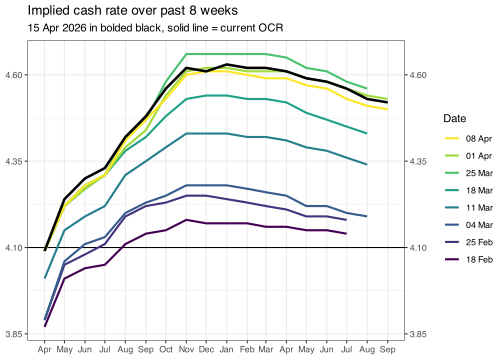
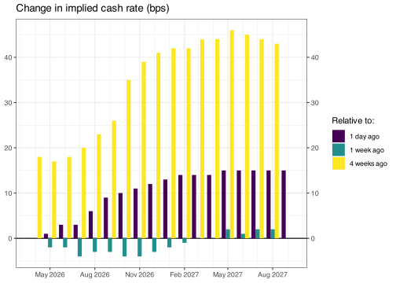

<!-- README.md is generated from README.Rmd. Please edit that file -->

# ASX Implied Cash Rate

This repo automatically scrapes the ASX 30 Day Interbank Cash Rate
Futures Implied Yield Curve from
[here](https://www.asx.com.au/data/trt/ib_expectation_curve_graph.pdf)
and converts it into a simple csv.

## Implied yield curve

    #> Warning: Removed 1 row(s) containing missing values (geom_path).

    #> Warning: Removed 3 rows containing missing values (geom_col).

