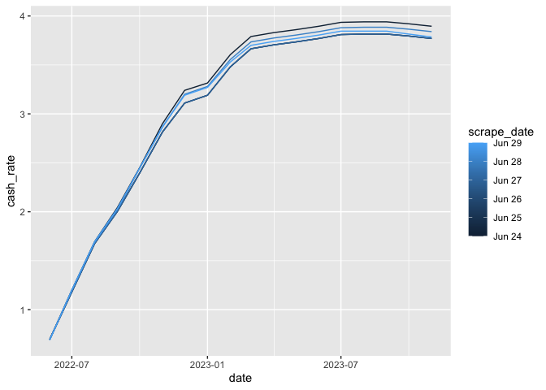

<!-- README.md is generated from README.Rmd. Please edit that file -->

ASX Implied Cash Rate
=====================

This repo automatically scrapes the ASX 30 Day Interbank Cash Rate
Futures Implied Yield Curve from
[here](https://www.asx.com.au/data/trt/ib_expectation_curve_graph.pdf)
and converts it into a simple csv.

Implied yield curve
-------------------

    all_data <- fread("combined-data/all_data.csv")

    ggplot(all_data, aes(x = date, y = cash_rate, colour = scrape_date, group = scrape_date)) +
      geom_line()

