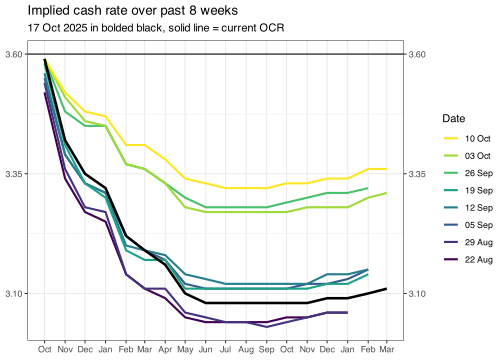
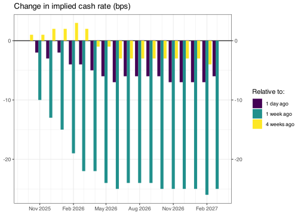

<!-- README.md is generated from README.Rmd. Please edit that file -->

# ASX Implied Cash Rate

This repo automatically scrapes the ASX 30 Day Interbank Cash Rate
Futures Implied Yield Curve from
[here](https://www.asx.com.au/data/trt/ib_expectation_curve_graph.pdf)
and converts it into a simple csv.

## Implied yield curve

    #> Classes 'data.table' and 'data.frame':   1609 obs. of  3 variables:
    #>  $ date       : Date, format: "2022-07-01" "2022-08-01" ...
    #>  $ cash_rate  : num  0.675 0.995 1.25 1.56 1.9 ...
    #>  $ scrape_date: Date, format: "2022-04-21" "2022-04-21" ...
    #>  - attr(*, ".internal.selfref")=<externalptr> 
    #> NULL

    #> Warning: Removed 1 rows containing missing values (geom_col).

