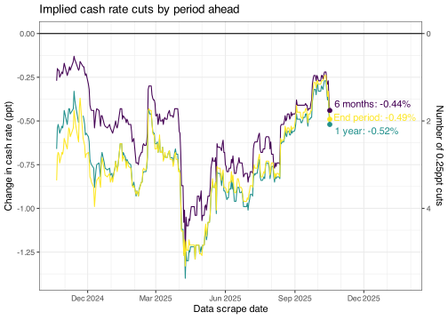

<!-- README.md is generated from README.Rmd. Please edit that file -->

# ASX Implied Cash Rate

This repo automatically scrapes the ASX 30 Day Interbank Cash Rate
Futures Implied Yield Curve from
[here](https://www.asx.com.au/markets/trade-our-derivatives-market/derivatives-market-prices/short-term-derivatives)
and converts it into a simple csv.

## Implied yield curve

<!-- Terminal CR graphs are no longer very relevant given likely CR peak -->
<!---

--->

